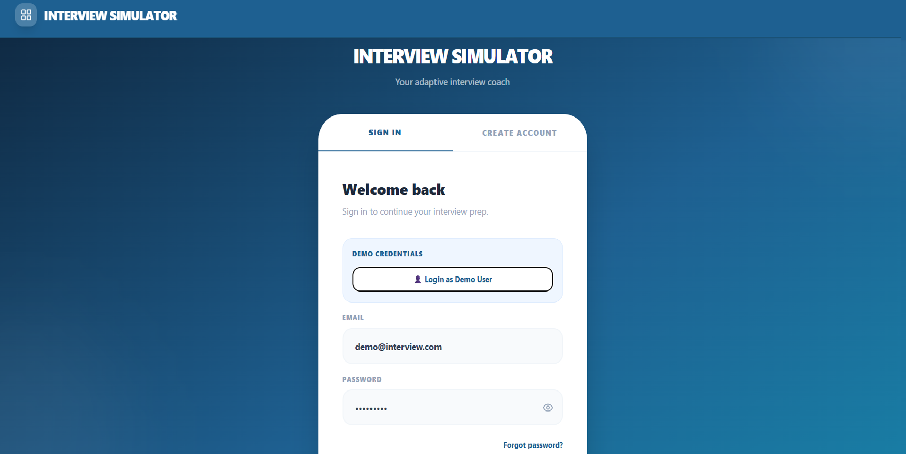
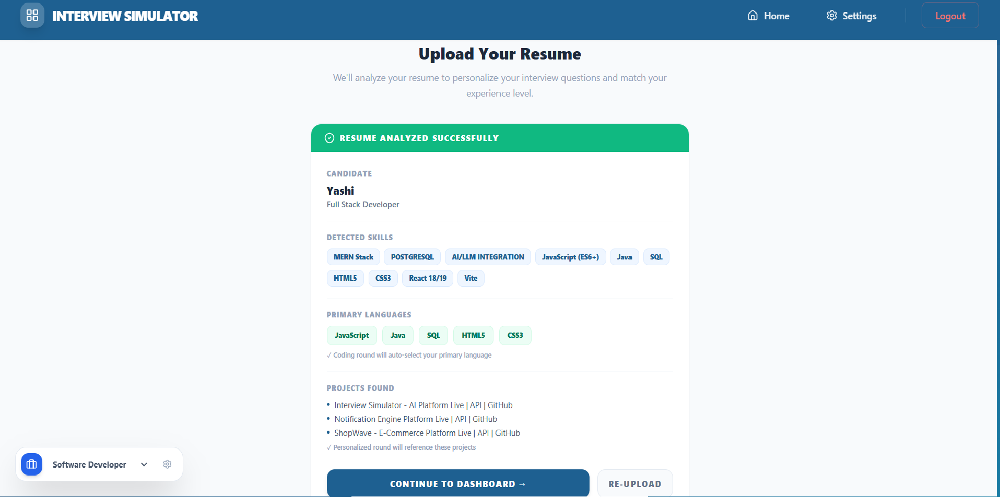
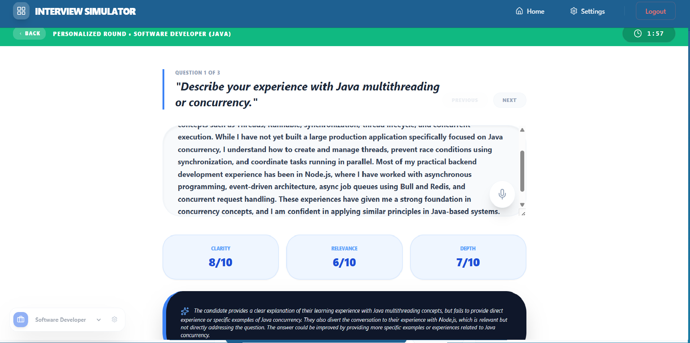
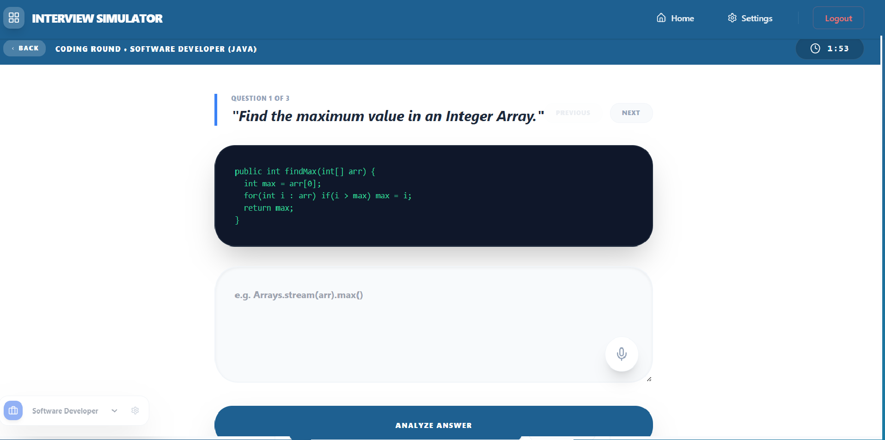
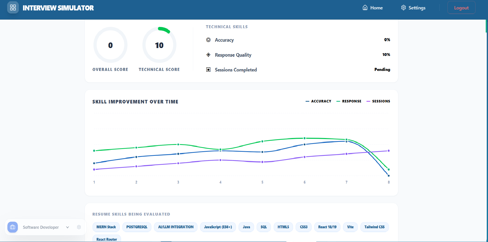
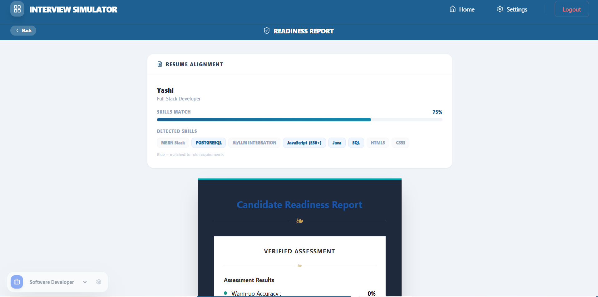

# 🤖 Interview Simulator

A full-stack, AI-powered interview preparation platform built with **React 19**, **Node.js**, **Express**, **Firebase**, and **Groq LLM**. Upload your resume, pick your role, answer AI-generated questions via text or voice, get scored in real time, and download a professional readiness report.

> Built to demonstrate full-stack development, LLM API integration, resume parsing, Firebase Auth + Firestore, speech recognition, and performance analytics.

🌐 **Live Demo:** [interview-simulator-ochre.vercel.app](https://interview-simulator-ochre.vercel.app)
⚙️ **Backend API:** [interview-simulator-uwtl.onrender.com](https://interview-simulator-uwtl.onrender.com)

---

## 🌐 Live Features

- 🧠 **AI-Generated Questions** — Role and language-specific questions powered by Groq (LLaMA 3.1) across 4 job tracks
- 📄 **Resume Parsing** — Upload a PDF; Groq extracts your name, role, skills, languages, and projects to auto-personalize your interview
- 🎙️ **Voice Input** — Answer questions via mic using the Web Speech API with real-time transcript
- 🏆 **3-Round Interview Flow** — Warm-Up MCQs → Coding/Technical Round → Personalized Resume-Based Questions
- ⏱️ **2-Minute Timer** — Per-question countdown with partial submission on timeout
- 📊 **Performance Dashboard** — Recharts line graphs tracking accuracy, response quality, and session trends
- 🧾 **Readiness Report** — AI-scored assessment (clarity / relevance / depth) with a downloadable print-ready HTML report
- 🌐 **Industry Modules** — AI explainer tracks for Tech & Coding, Consulting, Finance, and Sales & Marketing
- 🔐 **Firebase Auth** — Email/password + Google OAuth, forgot password via Firebase email reset
- 💾 **Firestore Sync** — Resume data and scores persisted per user UID across sessions
- 🌗 **Dark Mode** — Global toggle via Settings modal, persisted to localStorage
- ⚙️ **Settings Modal** — Edit profile, switch interview role, toggle dark mode, reset or clear progress

---

## 🛠️ Tech Stack

| Layer | Technology |
|-------|------------|
| Frontend | React 19, React Router DOM 7, Tailwind CSS 4 |
| Charts | Recharts 3 |
| Icons | Lucide React |
| Auth & Database | Firebase 12 (Auth + Firestore) |
| Backend | Node.js, Express 5 |
| AI / LLM | Groq API — LLaMA 3.1 8B Instant |
| Resume Parsing | Multer (memory storage) + raw buffer extraction |
| Speech Input | Web Speech API (browser-native) |
| HTTP | Axios (backend → Groq), Fetch API (frontend → backend) |
| Deployment | Vercel (frontend) + Render (backend) |
| Config | dotenv, CORS |

---

## 📸 Screenshots

### Login


### Resume Upload


### Personalised Round


### Coding Round


### Performance Dashboard


### Readiness Report

---

## 🗺️ App Routes

| Route | Page | Description |
|-------|------|-------------|
| `/auth` | Auth Page | Email/password + Google OAuth login and registration |
| `/resume` | Resume Upload | PDF drag-and-drop → Groq parses → personalizes session |
| `/` | Dashboard | 6-card grid linking to all rounds and reports |
| `/warmup` | Warm-Up Round | MCQ quiz — 3 questions per role and language |
| `/coding` | Coding Round | Code snippets + AI evaluation with scores |
| `/personalized` | Resume-Based Round | Questions generated from your actual resume projects |
| `/performance` | Performance Dashboard | Recharts graphs + skill tags from resume |
| `/industry` | Industry Modules | Choose a domain (Tech, Finance, Consulting, Marketing) |
| `/industry/:type` | Industry Content | Click a topic → AI explains it for interview prep |
| `/readiness` | Readiness Report | Final scored report with download as print HTML |

---

## 📡 API Endpoints

| Method | Endpoint | Description |
|--------|----------|-------------|
| GET | `/` | Health check — confirms API is running |
| GET | `/api/test` | Connection test between frontend and backend |
| POST | `/api/parse-resume` | Accepts PDF upload, extracts text, sends to Groq, returns structured JSON |
| POST | `/api/evaluate` | Accepts question + answer + role context, returns scores and feedback from Groq |
| POST | `/api/save-score` | Logs score server-side (Firestore sync handled on frontend) |

---

## ⚙️ Setup

### 1. Clone the repo
```bash
git clone https://github.com/Yashi1204/interview-simulator.git
cd interview-simulator
```

---

### 2. Backend

```bash
cd backend
npm install
```

Create `.env` in `/backend`:
```env
PORT=5000
GROQ_API_KEY=your_groq_api_key
```

```bash
node server.js
```

---

### 3. Frontend

```bash
cd frontend
npm install
```

Create `.env` in `/frontend`:
```env
REACT_APP_GROQ_API_KEY=your_groq_api_key
REACT_APP_BACKEND_URL=http://localhost:5000

REACT_APP_FIREBASE_API_KEY=your_firebase_api_key
REACT_APP_FIREBASE_AUTH_DOMAIN=your_project.firebaseapp.com
REACT_APP_FIREBASE_PROJECT_ID=your_project_id
REACT_APP_FIREBASE_STORAGE_BUCKET=your_project.firebasestorage.app
REACT_APP_FIREBASE_MESSAGING_SENDER_ID=your_sender_id
REACT_APP_FIREBASE_APP_ID=your_app_id
```

```bash
npm start
```

App runs at `http://localhost:3000` — backend at `http://localhost:5000`.

---

## 🔑 Key Technical Highlights

### Resume-Personalized Interview Flow
When a user uploads their PDF resume, the backend extracts raw text from the buffer and sends it to Groq LLM with a structured prompt. The model returns a clean JSON object — name, role, skills, languages, projects, education — which is stored in Firestore and localStorage. From that point, the coding round auto-selects the candidate's primary language, and the personalized round generates questions that directly reference their actual projects and experience.

### Groq LLM for Evaluation
Every submitted answer is sent to the backend `/api/evaluate` endpoint, which forwards it to Groq (LLaMA 3.1 8B Instant) with the question, role, language, and resume context. The model returns a JSON object with three scores — clarity, relevance, and depth (each out of 10) — plus a written feedback string and a model answer. The frontend parses this and renders it inline with animated score cards.

### Firebase Auth + Firestore Sync
Authentication supports both email/password and Google OAuth via Firebase. On login, the app loads the user's saved Firestore document (resume data, total score) and restores session state. On logout, all local state and localStorage are cleared. Password reset is handled via Firebase's `sendPasswordResetEmail`.

### Web Speech API Voice Input
Each question round includes a mic button that triggers the browser's `SpeechRecognition` API. Recognition runs continuously and appends final transcripts to the answer textarea in real time. The button pulses red while listening and handles errors for mic permission denial or no-speech detection.

### 2-Minute Countdown Timer
Each coding and personalized question starts a 120-second countdown. If the timer reaches zero, the textarea is locked, a "Time Expired" banner appears, and the user can still submit a partial answer for AI analysis. This mirrors real interview time pressure.

### Downloadable Readiness Report
The readiness report computes warm-up accuracy, matched resume skills against a tech keyword list, and pulls AI feedback from the session. The "Save Official Report" button opens a styled HTML page in a new tab and triggers the browser's print dialog — no server or PDF library required.

### Dark Mode via DOM Mutation Observer
Dark mode applies inline style overrides across all DOM elements by inspecting computed background and text colors. A `MutationObserver` on `document.body` reapplies the theme on every page navigation, ensuring consistent styling across React Router route changes without a full CSS-variable system.

---

## 🧠 What I Learned

- Engineering structured prompts for Groq LLM to return consistent, parseable JSON for both resume extraction and answer evaluation
- Building a full resume-to-interview personalization pipeline — PDF upload → text extraction → LLM parsing → session customization
- Implementing Firebase Auth from scratch including Google OAuth, email/password, and secure password reset with expiry
- Syncing per-user state (resume, scores) to Firestore and restoring it on login across devices
- Using the Web Speech API for real-time continuous voice transcription with interim and final result handling
- Building a countdown timer that locks input, triggers partial submission, and integrates with the AI evaluation flow
- Applying dark mode globally using a MutationObserver to re-theme dynamically rendered React Router pages
- Generating a downloadable assessment report as a styled HTML page with browser print — no PDF library needed
- Deploying a full-stack app with Vercel (frontend) + Render (backend) and resolving real-world CORS and dependency issues

---

## 👩‍💻 Author

**Yashi**
[GitHub](https://github.com/Yashi1204) • [LinkedIn](https://www.linkedin.com/in/yashi1204)

---

## 📄 License

MIT
